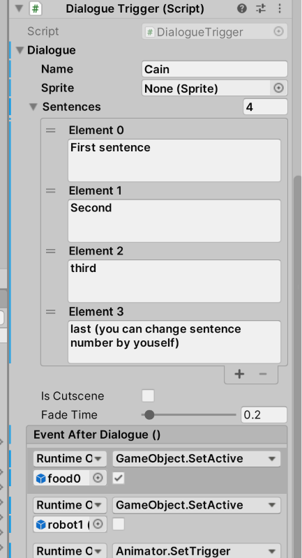
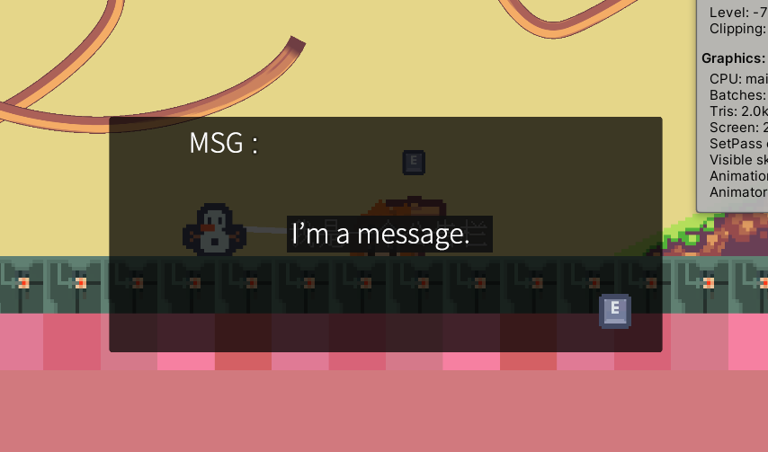
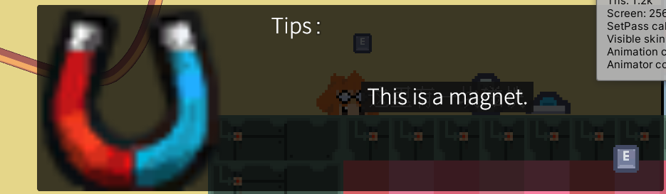
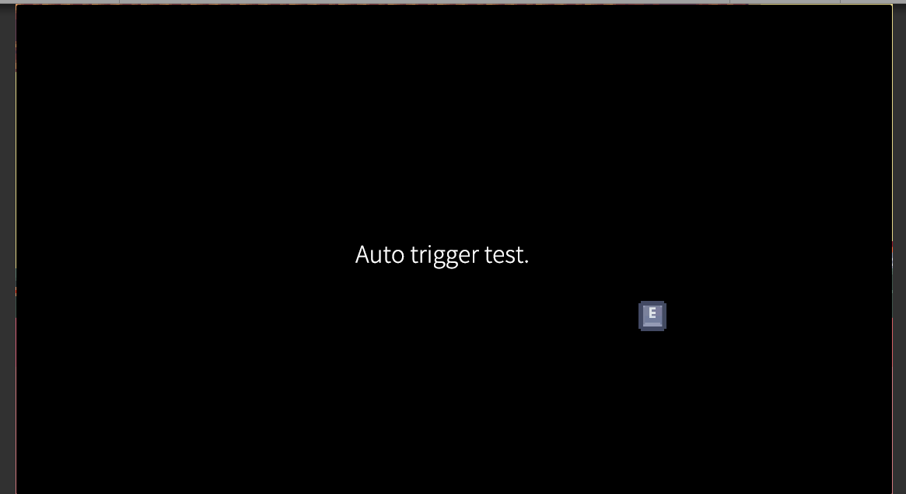

## 日本語訳：

# ゲーム開発ドキュメント

- [ゲーム開発ドキュメント](#ゲーム開発ドキュメント)
  - [プレイヤーキャラクターコントローラー](#プレイヤーキャラクターコントローラー)
    - [キャラクター移動管理](#キャラクター移動管理)
    - [キャラクターアニメーション管理](#キャラクターアニメーション管理)
    - [ロボットの攻撃](#ロボットの攻撃)
  - [インタラクティブオブジェクト](#インタラクティブオブジェクト)
    - [圧力板](#圧力板)
    - [浮動プラットフォーム](#浮動プラットフォーム)
    - [ジャンプ台](#ジャンプ台)
    - [磁石（ブロック）](#磁石ブロック)
    - [磁石（アイテム）](#磁石アイテム)
    - [レール](#レール)
  - [UI インターフェース](#ui-インターフェース)
    - [キーヒント](#キーヒント)
    - [キーインタラクション](#キーインタラクション)
    - [会話システム](#会話システム)
    - [レベル切り替え](#レベル切り替え)
  - [付録](#付録)
    - [Path Creator](#path-creator)

## プレイヤーキャラクターコントローラー

### キャラクター移動管理

キャラクターの移動管理は `PlayerController` クラスによって処理され、キーボード入力は `PlayerGameInput` クラスによって監視されます。

`PlayerController` には 3 つの公開属性があります。

| 属性 | 機能 |
|---|---|
| pm | プレイヤー移動設定ファイル。詳細は (1) を参照 |
| Sprite Transform | プレイヤースプライトを持つ子ゲームオブジェクトの名前 |
| Player Input | 空欄にするべきではない。空欄の場合は `PlayerGameInput` をドラッグアンドドロップ |

**(1) プレイヤー移動設定ファイル**

プレイヤー移動設定ファイルは `Assets/Profiles` フォルダに配置されます。ジャンプ判定を行うレイヤー、地面摩擦力（重要：プレイヤーがジャンプ落下時に壁に張り付かないようにするため、ジャンプ中は 0 に設定し、地面接触時に設定値に戻す）を設定できます。ジャンプ欄では、ジャンプ高さ、地面判定距離（斜面でジャンプできない場合はこの値を高くする）、地面判定半径とジャンプのクールダウン時間を設定できます。行走欄では、加速度と最高速度（Move Clamp）を設定できます。その他の項目は現時点では使用されていません。

**(2) キーバインド設定ファイル**

キーバインド設定ファイルは `Assets/Input System` フォルダにあります。ダブルクリックして開くと、Gameplay と UI の 2 つのキーセットが表示されます。Actions には、各キーセットに対応するキーとコントロールデバイスが表示されます。これらのキーバインドを変更すると、`Player Controller Input` クラスが自動的に生成されます。

### キャラクターアニメーション管理

キャラクターアニメーションはステートマシンによって管理されます。`Player` コンポーネントの `PlayerStateMachine` でステートマシンを追加でき、ステートマシンの切り替えロジックは各ステートマシンのクラスで処理されます。

### ロボットの攻撃

`Spin Attack Hard` クラスは回転攻撃用クラスです。`Spin Attack` クラスも存在しますが、バグが多いため廃止されています。

| 属性 | 機能 |
|---|---|
| Spin Speed | 回転速度 |
| Player Game Input | プレイヤー入力クラスの場所 |
| Ground Layer | 地面レイヤー |
| Action CD | 回転間隔時間 |

`Magnet Snap` はロボットの磁力吸引スキルです。下の `Snapping` は手動でチェックしないでください。

## インタラクティブオブジェクト

### 圧力板

`Pressure Plate` は実際には汎用トリガーです。動作するには、`Pressure Plate` スクリプトと `isTrigger` に設定された `Collider 2D` が必要です。イベントをバインドするには、対応するイベントパネルの右下隅にある + 記号をクリックし、左側のオブジェクト選択ボックスでイベントを制御するオブジェクトをドラッグアンドドロップし、右側のドロップダウンリストボックスでアクティブ化する必要がある関数を検索します。

トリガータイプは、プレイヤー、ロボット、磁力オブジェクト、または上記のすべてを選択できます。

### 浮動プラットフォーム

浮動プラットフォームは、少なくとも 1 つのパス ポイントが必要です。

`StartPlatform` 関数を使用してアクティブ化します。

`Ground Layer` に設定することを忘れないでください。

| 属性 | 機能 |
|---|---|
| Auto Start | 自動開始 |
| loop | 自動ループ |
| Wait Secs | 各パス ポイントでの待ち時間 |
| RepeatMethod | プラットフォームの繰り返し方法。`None` に設定すると、最終的なパス ポイントに到達した後、停止します。
| | `PingPong` は元のパスに戻り、`Cycling` は周回します。 |

### ジャンプ台

ジャンプ台はプレイヤーを上方向にジャンプさせることができます。

ジャンプ台を動作させるには、まずスクリプトがアタッチされているオブジェクトに `Sprite Render`（押し下げ時の変化を表示）、`Kinematic` に設定された `Rigidbody2D`、`Collider 2D` があることを確認する必要があります。

プレイヤーが自由にジャンプできるようにするには、`Ground Layer` に設定することを忘れないでください。

`Triggered` 関数を使用してアクティブ化します。

| 属性 | 機能 |
|---|---|
| Reset Time | ポップアップ後にリセットするまでの時間 |
| Jump Height | ジャンプ高さ |
| Released Sprite | ポップアップ後のスプライト |

### 磁石（ブロック）

磁石（ブロック）は、プレイヤーを吸着させることができます。

磁石を動作させるには、磁石が `Kinematic` に設定された `Rigidbody 2D` と `isTrigger` に設定された `Collider 2D` である必要があります。

| 属性 | 機能 |
|---|---|
| Force | 磁力 |
| Fix Distance | 吸着させる距離 |
| Magnet Type | 磁石の種類。固定タイプの磁石は `Hook` |

### 磁石（アイテム）

磁石（アイテム）はプレイヤーに引き寄せられます。

磁石（アイテム）は磁石（ブロック）と同様に、動作させるには `isTrigger` の `Collider 2D` が必要です。磁石（アイテム）の `Rigidbody 2D` は `Dynamic` 属性にする必要があり、`Magnet` スクリプトの `Magnet Type` は `Item` に設定する必要があります。

レールとインタラクトさせるには、このゲームオブジェクトのタグを `Cart` に設定する必要があります。

| 属性 | 機能 |
|---|---|
| Force | 磁力 |
| Fix Distance | 吸着させる距離（このタイプは無効） |
| Magnet Type | 磁石の種類。`Item` に設定する必要があります |

### レール

レールは `Path Creator`を使用して曲線を作成します。`Centre Transform` は座標ポイントを中央揃えし、`Reset Path` はカーブを 2 つの端点にリセットします。`Path Creator` の使用方法については、付録を参照してください。

`Path Creator` でレールを作成した後、`生成レール` をクリックしてレールテクスチャを生成し、`校準入口` をクリックして入口コリジョンボックスを入口に合わせることができます。

レベルデザインツールで事前にレールにオブジェクトを追加する場合は、そのオブジェクトを `Object Rigidbody` にドラッグアンドドロップする必要があります。

 

## UI インターフェース

### キーヒント

キーヒントは、インタラクションに必要なキーを UI やシーン内に表示できます。

キーヒントの保存場所は `Prefab/Buttons` フォルダの下です。

末尾が `Sprite` となっているものはゲームシーンでのヒント、それ以外は UI ヒントです。

### キーインタラクション

押す以外のインタラクションにも、キーインタラクションコンポーネントが用意されています。

このコンポーネントは、`isTrigger` に設定された `Collider 2D` が必要です。

イベントをバインドするには、対応するイベントパネルの右下隅にある + 記号をクリックし、左側のオブジェクト選択ボックスでイベントを制御するオブジェクトをドラッグアンドドロップし、右側のドロップダウンリストボックスでアクティブ化する必要がある関数を検索します。

`Key Suggestion` セクションでは、シーン内のキーヒントゲームオブジェクトを選択する必要があります。

### 会話システム

会話システムが機能するためには、シーン内に `Dialogue Manager` スクリプトが存在する必要があります。会話システムが正常に動作しない場合は、このスクリプトが存在しているかどうかを確認してください。

会話システムには、さまざまなモードと選択肢があります。

| 属性 | 機能 |
|---|---|
| Name | 会話中のキャラクター名/アイテム名 |
| Sprite | 会話のアバター |
| Sentences | セリフ（複数ページに分けることができる） |
| Is Cutscene | カットシーンかどうか。選択すると背景が黒くなります。 |
| Fade Time | フェードイン/フェードアウト時間 |
| Event After Dialogue | 会話後にトリガーされるイベントリスト |

会話をトリガーするには、イベントリストに `Trigger Dialogue` を追加する必要があります。

アバターのないダイアログボックス

アバター付きのダイアログボックス

黒画面のダイアログボックス

### レベル切り替え

フェードアウト効果を追加してシーンを切り替えるには、各シーンに `Switch Scene` を追加することをお勧めします。

ターゲットレベルはレベル名で判断されます（たとえば、`beginning.unity` の `Level Name` は `beginning` になります）。

イベントリスト内で `.NextLevel` をトリガーすると、レベルが切り替わります。

 

## 付録

### Path Creator

**パスを作成するには**

1. **GameObject** を作成します。
2. 作成した **GameObject** に **Path Creator** スクリプトを追加します。
3. シーン内に **ベジェ曲線** が表示されます。

**ベジェ曲線** は、**锚点** と **控制点** という 2 種類の点で定義されます。

* **锚点** は、パスが実際に通過する点です。
* **控制点** は、パスの曲率を定義します。

**点の操作**

* **点の移動:** 左クリックしてドラッグします。
* **点の選択:** クリックします。選択した点は、移動ツールになります。
* **新しい锚点の追加:** パス末端で Shift キーを押しながら左クリックします。Ctrl キーを押しながら左クリックすると、パスの始点に追加されます。
* **点の挿入:** 既存のパスセグメント上で Shift キーを押しながら左クリックします。
* **点の削除:** 锚点上で Ctrl キーを押しながらクリックします。

**詳細情報**

* **Path Creator** の詳細については、以下の Google ドキュメントを参照してください。

> Path Creator の詳細(Google Docs): [https://docs.google.com/document/d/1-FInNfD2GC-fVXO6KyeTSp9OSKst5AzLxDaBRb69b-Y/](https://docs.google.com/document/d/1-FInNfD2GC-fVXO6KyeTSp9OSKst5AzLxDaBRb69b-Y/)

