# **游戏开发文档**

- [**游戏开发文档**](#游戏开发文档)
  - [**角色控制器组件**](#角色控制器组件)
    - [**角色的移动管理**](#角色的移动管理)
    - [**角色的动画管理**](#角色的动画管理)
    - [**机器人的攻击**](#机器人的攻击)
  - [**可交互物品**](#可交互物品)
    - [**压力板**](#压力板)
    - [**浮动平台**](#浮动平台)
    - [**弹簧平台**](#弹簧平台)
    - [**磁铁（砖块）**](#磁铁砖块)
    - [**磁铁（物品）**](#磁铁物品)
    - [**轨道**](#轨道)
  - [**UI界面**](#ui界面)
    - [**按键提示**](#按键提示)
    - [**按键交互**](#按键交互)
    - [**对话系统**](#对话系统)
    - [**关卡切换**](#关卡切换)
  - [**附录**](#附录)
    - [**Path Creator**](#path-creator)

## **角色控制器组件**
### **角色的移动管理**

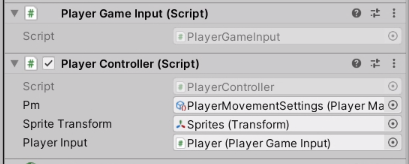

角色的移动管理由PlayerController类负责，由PlayerGameInput类负责监听键盘的输入。

PlayerController拥有3个公开属性：

| 属性 | 功能 |
| ---- | ---- |
| pm | 玩家移动的配置文件，详见(1) |
| Sprite Transform | 带有玩家贴图的子GameObject名称 |
| Player Input | 这个本不该手选的，如果这项空了就把PlayerGameInput拖入 |

**(1) 角色移动配置文件**

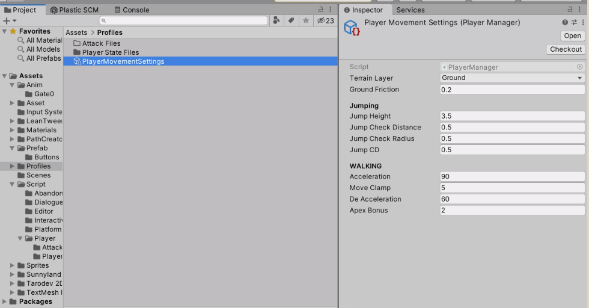

角色移动配置文件放置在目录Assets/Profiles下，可以设置跳跃检测所在的层、地面摩擦力（重要，为防止玩家在跳跃下落时粘在墙上，该值在跳跃时置0，在接触地面时恢复为设定值）。跳跃栏可以设置跳跃高度、地面检测距离（若斜坡无法起跳可调高该值）、地面检测半径与跳跃的CD时间。行走栏下可设置加速度与最高速度（Move Clamp），其余选项目前并没有实际用处。

**(2) 键位配置文件**

键位配置文件文娱Assets/Input System下，双击打开后可以看到Gameplay与UI的两组按键，在Actions中有每组按键所对应的键位与控制设备。对其进行的更改会自动生成Player Controller Input类。

### **角色的动画管理**

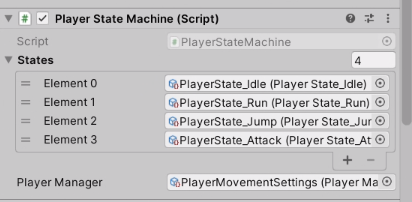

角色动画使用状态机进行管理，在Player组件下的PlayerStateMachine中可以添加状态机，状态机的切换逻辑在每个状态机的类中进行。

### **机器人的攻击**

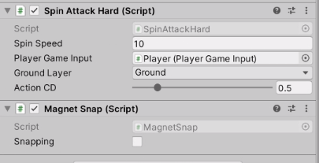

Spin Attack Hard类为旋转攻击类，目录下还有一个SpinAttack类，那个类是废弃的，因为bug太多。

| 属性 | 功能 |
| ---- | ---- |
| Spin Speed | 甩动速度 |
| Player Game Input | 玩家输入类所在位置 |
| Ground Layer | 地面层 |
| Action CD | 甩动间隔时间 |

Magnet Snap为机器人的磁吸技能，底下的Snapping不要手动去勾

 

## **可交互物品**

### **压力板**

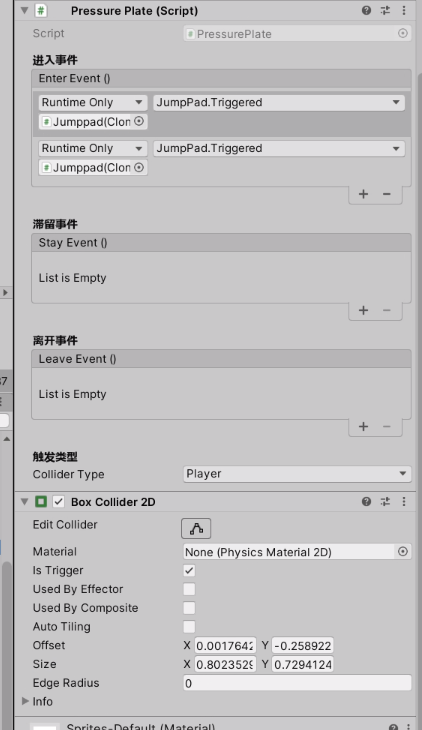

Pressure Plate实际上是一个通用的触发器，使其工作需要Pressure Plate脚本与标记为isTrigger的Collider 2D，为其绑定事件需要点击对应事件面板右下角的+号，在左侧对象选择框内拖入需要控制事件的对象，在右侧下拉列表框里找到需要激活的函数。

触发类型可以选择玩家、机器人、磁力物品或以上全部

### **浮动平台**

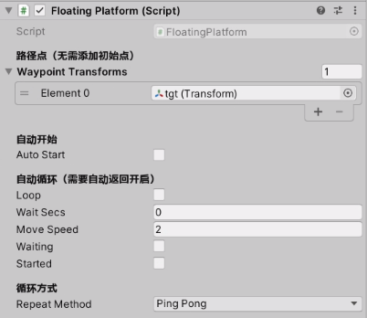

浮动平台的工作需要至少一个路径点

使用StartPlatform函数激活

请记得将其设置至Ground Layer

| 属性 | 功能 |
| ---- | ---- |
| Auto Start | 自动开始 |
| loop | 自动循环 |
| Wait Secs | 在每个路径点的等待时间 |
| RepeatMethod | 平台的重复方式，设置为None的情况下将在到达最终路径点后停下。
| | 乒乓是原路返回，Cycling 是兜圈子|

### **弹簧平台**

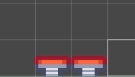

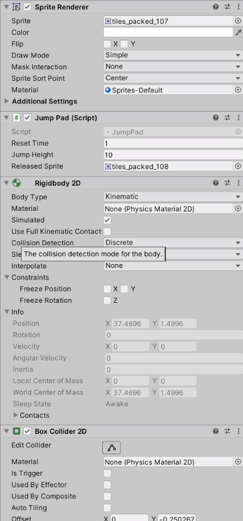

跳跃平台可以使玩家向上跳起

使跳跃平台工作，首先要确保挂在脚本的物体上有Sprite Render（展示压下时的变化）、标记为Kinematic的Rigidbody2D、Collider 2D

若要玩家可自行跳跃请记得将其设置至Ground Layer

使用Triggered函数激活

| 属性 | 功能 |
| ---- | ---- |
| Reset Time | 弹出后读秒收回 |
| Jump Height | 跳跃高度 |
| Released Sprite | 弹出后贴图 |

### **磁铁（砖块）**

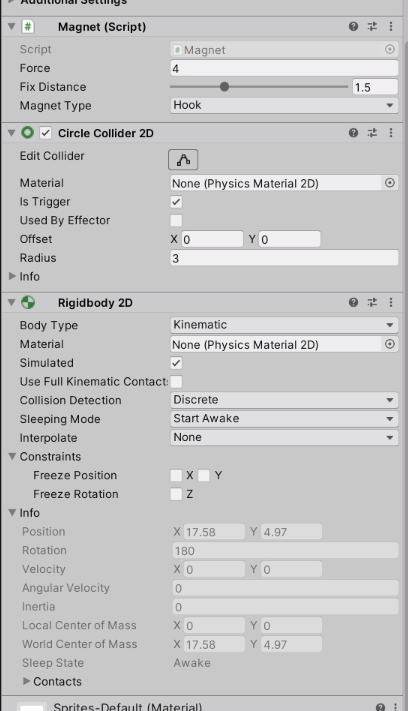

磁铁（砖块）可以让玩家吸附在上面

使磁铁工作需要磁铁是挂载标记为Kinematic的Rigidbody 2D与标记为isTrigger的Collider 2D.

| 属性 | 功能 |
| ---- | ---- |
| Force | 磁铁吸力 |
| Fix Distance | 在多少距离时吸住 |
| Magnet Type | 磁铁类型，固定的磁铁类型为Hook |

### **磁铁（物品）**

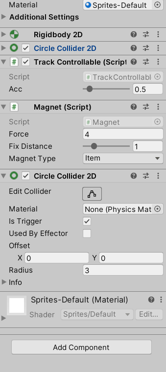

磁铁（物品）可以被玩家吸引

磁铁（物品）与磁铁（砖块）类似，都需要isTrigger的Collider 2D才可工作，磁铁（物品）的Rigidbody 2D需为Dynamic属性，Magnet脚本的Magnet Type需设置为Item

若要与轨道交互，此Gameobject的Tag需设置为Cart

| 属性 | 功能 |
| ---- | ---- |
| Force | 磁铁吸力 |
| Fix Distance | 在多少距离时吸住，此类型无效 |
| Magnet Type | 磁铁类型，需设置为Item |

### **轨道**

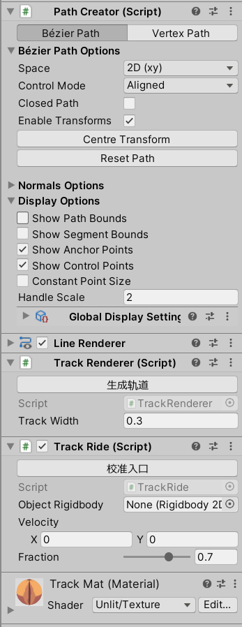

轨道使用Path Creator创造曲线，其中Centre Transform是将坐标点归中，Reset Path是重置曲线到两个端点，Path Creator的使用方法详见附录

在使用Path Creator创建完轨道后，可单击生成轨道来生成轨道贴图，单击校准入口使入口碰撞箱对准入口。

若要在关卡设计器中提前向轨道添加物品，需要将该物品拖入Object Rigidbody中。

 

## **UI界面**

### **按键提示**

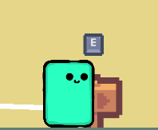

按键提示可以在UI或场景中显示交互所需的按键

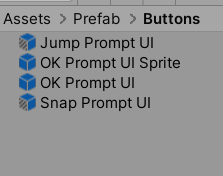

按键提示的存放位置在Prefab/Buttons下

末尾标注为Sprite的为游戏场景中提示，未标注为UI提示

### **按键交互**

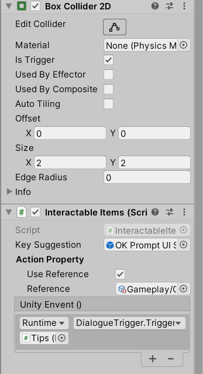

除了按压交互，也提供了按键交互组件。

该组件需要标记为isTrigger的Collider 2D才可工作

为其绑定事件需要点击对应事件面板右下角的+号，在左侧对象选择框内拖入需要控制事件的对象，在右侧下拉列表框里找到需要激活的函数。

Key Suggestion一栏需要选择场景中的按键提示Gameobject。

### **对话系统**

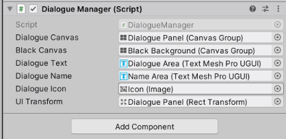

对话系统工作的前提是场景中存在Dialogue Manager脚本，若对话系统工作不正常，请检查该脚本是否存在

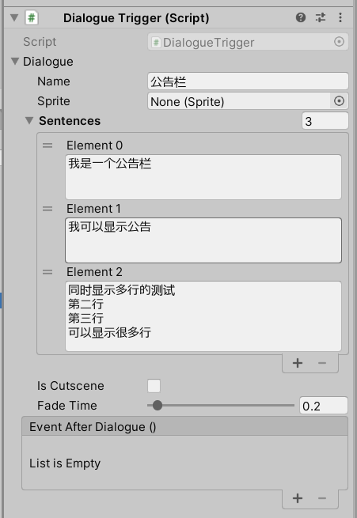

对话系统有多种模式、多个选项

| 属性 | 功能 |
| ---- | ---- |
| Name | 对话中的角色名称/物品名称 |
| Sprite | 对话的头像 |
| Sentences | 台词，可分多页 |
| Is Cutscene | 是否为过场动画，选择是将会使背景黑屏 |
| Fade Time | 淡入淡出时间 |
| Event After Dialogue | 对话后触发事件列表 |

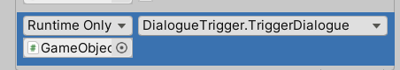

触发对话需要在事件列表中添加Trigger Dialogue

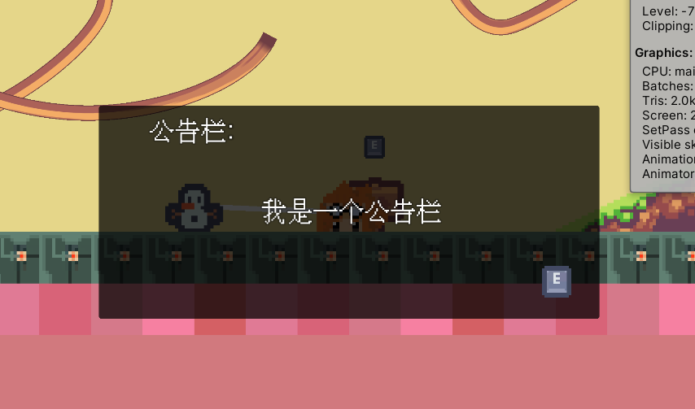

不带头像的对话框

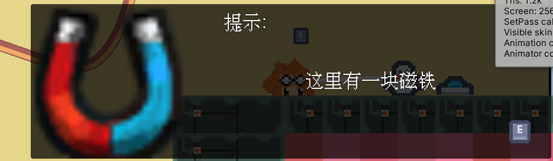

带头像的对话框

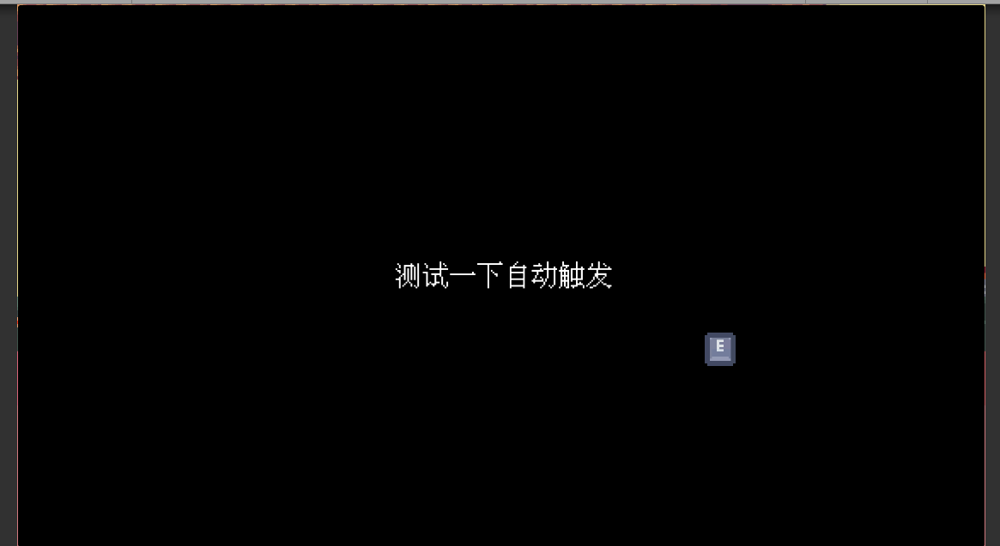

黑屏对话框

### **关卡切换**

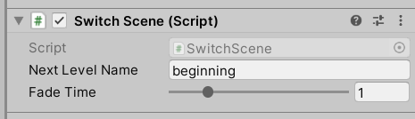

建议每关都在场景里加入Switch Scene，以添加切换场景的淡出效果。

目标关卡以关卡名称判断（例如beginning.unity的Level Name即为beginning）

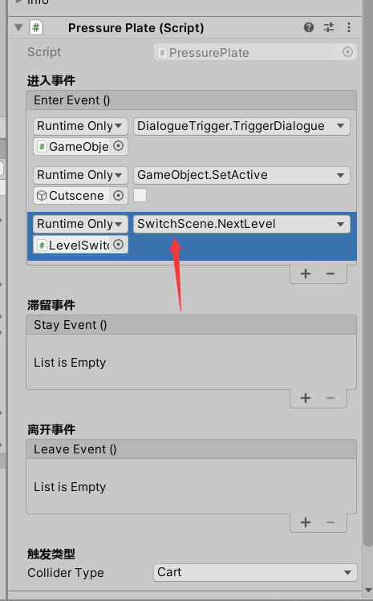

在事件列表中触发.NextLevel以切换关卡

 

## **附录**

### **Path Creator**

要开始创建一个路径，创建一个GameObject并将PathCreator脚本添加到它上面。你会看到场景中出现一个贝塞尔路径。

贝塞尔路径是由两种类型的点定义的：锚点和控制点。锚点是路径实际经过的点，而控制点允许你定义路径的曲率。

**移动点**

左键点击并拖动来移动这些点。如果你点击一个点而不拖动，它将变成一个带有箭头的移动工具，这样你就可以沿着一个轴线移动。

**添加和插入点**

Shift-left点击可以在路径的末端添加新的锚点（按住ctrl键可以代替添加到路径的起点）。要插入一个点，请在现有的路径段上按下Shift-left click。

**删除点**

在一个锚点上按下Ctrl键来删除它。

[关于Path creator 的更多内容(Google Docs)](https://docs.google.com/document/d/1-FInNfD2GC-fVXO6KyeTSp9OSKst5AzLxDaBRb69b-Y/)